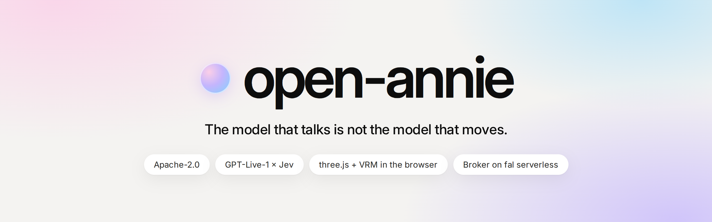
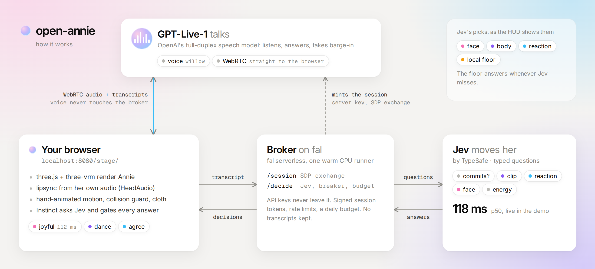

<p align="center">
  
</p>

https://github.com/user-attachments/assets/a54b7354-3331-408f-9fdb-aa5be35c8392

<p align="center"><sub>Recorded live, with sound (1:37) · <a href="docs/media/open-annie-demo.mp4">download the mp4</a></sub></p>

**open-annie** is an open-source 3D character you talk to in the browser. One model talks:
GPT-Live-1, a full-duplex speech model, speaks with you over WebRTC. A second model moves her:
[Jev](https://typesafe.ai) reads the live transcript and picks Annie's face, gestures and body
language in about 120 ms. Her mouth is lip-synced from the audio you hear. Everything visual runs
in the browser, and the only server is a thin broker on [fal serverless](https://fal.ai/serverless).

The demo is one real session, recorded in a single take and replayed frame for frame:

- **Annie** is GPT-Live-1 (voice `willow`), answering live. Her words are her own.
- **You** are six scripted lines, performed by an AI voice (OpenAI `gpt-audio-1.5`, voice `cedar`)
  and spoken into a synthetic microphone.
- **Every face, gesture and dance** is a live Jev decision: 51 of them, p50 118 ms, $0.0026 of
  Jev for the whole conversation.

## Quick start

No keys needed to look around. From a clone of this repo:

```bash
python3 -m http.server 8080
```

| open | what you get |
|---|---|
| <http://localhost:8080/stage/> | the scripted preview: Annie's lines from Kokoro-82M, decisions from the local rule floor |
| <http://localhost:8080/stage/?replay=demo/live/session.json&decisions=demo/live/decisions.json> | the recorded live session from the video, with its real Jev decisions |

To talk to her, you need an OpenAI key with GPT-Live access and a [TypeSafe](https://typesafe.ai) key:

```bash
cp .env.example .env          # fill in OPENAI_API_KEY and TYPESAFE_API_KEY
cd broker && uv venv .venv --python 3.12 && uv pip install --python .venv/bin/python -r requirements.txt
.venv/bin/python local.py     # the broker, on http://127.0.0.1:8787
```

Then open <http://localhost:8080/stage/?live=1&broker=http://127.0.0.1:8787> and allow the microphone.

| parameter | effect |
|---|---|
| `?avatar=vivi`, `?avatar=annie` | another avatar (see [assets/](assets/README.md)); the default is Annie without her jacket |
| `?outfit=full` | Annie with her jacket |
| `?lipsync=energy` | the energy-only mouth, without HeadAudio visemes |

## How it works

<p align="center">
  
</p>

1. **Voice.** GPT-Live-1 speaks straight to the browser over WebRTC. Voice audio never touches the
   broker, so you get realtime playout, loss concealment and clean barge-in for free. The broker only
   does the SDP exchange with the server key.
2. **Instinct.** While *you* talk, Annie asks Jev one question: which face would a listening friend
   make? Her face changes before she answers. While *she* talks, transcript fragments (at most 4 asks
   a turn) ask five questions in one request: is she committing to an action, which clip, which
   reaction, which face, how much energy. The questions are in
   [`packages/core/src/instinct.js`](packages/core/src/instinct.js).
3. **Gates, not vibes.** Code keeps control. Jev only picks from clips that are installed, and every
   answer passes a confidence gate before it can act. Actions such as dancing need a spoken
   commitment, and a refusal ("no backflips, sorry") vetoes motion. Any Jev miss (timeout, 429,
   breaker, no key) falls back to a local rule floor, so she never waits.
4. **Lipsync from the audio.** GPT-Live emits no visemes. HeadAudio (vendored, MIT) classifies 15
   visemes from the decoded audio every 16 ms, and `mouth.js` pools them into the avatar's mouth
   shapes with loudness from an energy follower. It is measured against phoneme ground truth in
   [`lipsync-eval/`](lipsync-eval/README.md).
5. **A body animated by hand.** Every clip is keyed on an IK control rig in headless Blender: idles,
   listening, Jev's clips (wave, dance, shrug, …), talk-rest loops and 32 co-speech gesture phrases.
   Each is collision-checked against Annie's deformed mesh and baked into a CC0 motion pack
   ([`motion/`](motion/README.md)). At runtime every switch is inertialized, gesture strokes land on
   the stressed syllables of her own voice, a per-frame collision guard keeps her hands out of her
   body, and her hair and skirt swing on substepped VRM spring bones.
6. **Faces with an envelope.** Expressions ease in and out per family (alert, warm, down, hot, calm),
   so her face reacts quickly without flickering.

### Deploy the broker on fal

```bash
fal secrets set ANNIE_OPENAI_API_KEY=sk-... ANNIE_TYPESAFE_API_KEY=... ANNIE_HMAC_SECRET=$(python -c "import secrets;print(secrets.token_urlsafe(32))")
fal secrets set ANNIE_ALLOWED_ORIGINS=https://your-stage.example.com
fal deploy broker/fal_app.py::AnnieBroker --app-name annie-broker --auth public
curl https://fal.run/<you>/annie-broker/health
```

It runs on one always-warm CPU runner (`S`, `min_concurrency=1`, `keep_alive=300`,
`max_multiplexing=32`). By default it caps sessions at 180 s, hangs up after 30 s of silence, allows
2 sessions per IP per day and stops at a daily dollar budget, and it never forwards upstream error
bodies. Secrets are `ANNIE_`-prefixed because fal shares secrets across an account's apps. See
[broker/README.md](broker/README.md) and the verified upstream contracts in
[broker/UPSTREAM.md](broker/UPSTREAM.md).

## Numbers

| | measured |
|---|---|
| The recorded session in the video (97 s, GPT-Live-1 + Jev) | 51 decisions, all live Jev; p50 118 ms, p90 151 ms; $0.0026 of Jev |
| Jev upstream, 20 warm sequential requests | p50 108 ms, p90 149 ms; the broker adds ~1 ms |
| GPT-Live-1 voice | $0.05 / min, billed per second including silence |
| Body, over all 2,912 frames of the replay (`demo/bodyprobe.mjs`) | no hand or forearm more than 10 mm inside her body (worst 5.4 mm, one frame); 92% of gesture strokes within 100 ms of a voice onset, p50 26 ms |

## Repo

```
stage/              the page (no build step, CDN import map): scene, HUD, live mode, replay
packages/core/src/  character: motion, gesture timing, collision guard, cloth · faces · lipsync + mouth
                    instinct: Jev questions, pacer, gates · floor: rules · voices: GPT-Live, scripted, replay
broker/             the only server: Python core, fal App, local runner, tests, upstream notes
assets/             avatars and the motion pack, each with a licence manifest (scripts/check_assets.py)
motion/blender/     the Blender pipeline that authors the motion pack
persona/            character.md + voice.md: swap these to make a different character
demo/               the keyless preview's script and voice lines, the recorded session, QA probes
lipsync-eval/       offline lipsync measurement against phoneme ground truth
docs/               contracts.md (the interfaces) and README media (with their source pages)
```

## Privacy, safety and honesty

- No analytics. The broker never logs or retains transcripts. Your mic audio goes to OpenAI, and
  transcript text goes to TypeSafe.
- Annie says she is an AI in her first reply, keeps things suitable for general audiences, and
  points to 988 if someone mentions self-harm ([`persona/character.md`](persona/character.md)).
- Both voices in the demo video are AI-generated. The session itself is not edited: it is replayed
  frame by frame from the recording.

## Licenses

Code is Apache-2.0 ([LICENSE](LICENSE)). Assets carry their own licences, recorded per file with
hashes and checked in CI (see [NOTICE](NOTICE) and [assets/README.md](assets/README.md)):

- **Avatars:** pixiv's official VRoid sample models. AvatarSample_A and AvatarSample_B use pixiv's
  sample-model terms (free use, modification and redistribution; not CC0). Vivi is CC0.
- **Motion:** the `annie-blender` pack is authored in this repository and released CC0.
- **Audio:** the demo's audio is AI-generated: GPT-Live-1 and `gpt-audio-1.5` (OpenAI) for the live
  take and the user lines, Kokoro-82M (Apache-2.0) for the preview.

## Contributing

Issues and pull requests are welcome; see [CONTRIBUTING.md](CONTRIBUTING.md). Please report
security issues privately, as described in [SECURITY.md](SECURITY.md).

## Roadmap

- **An open voice on a fal GPU:** NVIDIA PersonaPlex-7B, full duplex with a text stream, behind the
  same voice interface. That gives Annie with no OpenAI at all.
- A hosted demo, foot locking, a Gemini Live voice provider, and per-voice lipsync calibration.

## Thanks

[three-vrm](https://github.com/pixiv/three-vrm), [VRoid](https://vroid.com) sample models by pixiv,
[TalkingHead / HeadAudio](https://github.com/met4citizen/TalkingHead), [Kokoro](https://huggingface.co/hexgrad/Kokoro-82M),
and prior art in [ChatVRM](https://github.com/pixiv/ChatVRM), [AIRI](https://github.com/moeru-ai/airi)
and [jev-stage](https://github.com/GY19A/jev-stage).
